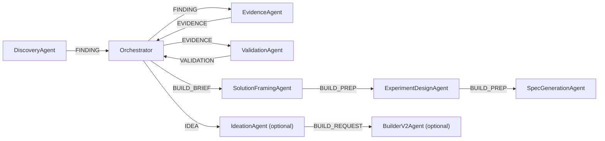

# Engineering Specification

This document is the engineering-level functional, architectural, configuration, and dataflow specification for the current AutoResearch MLX runtime.

It is intended to describe the system as it exists in code today, not a future-state design.

## 1. Purpose

AutoResearch MLX is an evidence-first problem-discovery pipeline. Its purpose is to:

1. discover candidate pain signals from public sources
2. classify and screen those signals before structuring them
3. extract reusable problem atoms from accepted pain evidence
4. cluster related atoms into opportunities
5. validate recurrence, corroboration, and commercial potential
6. gate only sufficiently promising opportunities into build-facing artifacts

The current core runtime path is:

`discovery -> evidence -> validation -> build_prep`

Optional downstream stages:

- `ideation`
- `builder`

These optional stages are not part of the minimal evidence-validation loop and are enabled only through config.

## 1.1 Packaging and entrypoints

The project now supports both repo-root execution and installed execution:

- repo-root development: `python cli.py ...`
- installed console script: `autoresearch ...`
- module entry: `python -m src`

Packaging is defined in [pyproject.toml](/Users/meganpastore/Projects/autoresearch-mlx/pyproject.toml). The wheel/editable install includes:

- top-level runtime entry modules: [cli.py](/Users/meganpastore/Projects/autoresearch-mlx/cli.py), [run.py](/Users/meganpastore/Projects/autoresearch-mlx/run.py)
- the `src` package tree
- packaged fallback runtime resources under [src/resources](/Users/meganpastore/Projects/autoresearch-mlx/src/resources)

Installed execution uses packaged fallback copies of:

- [config.yaml](/Users/meganpastore/Projects/autoresearch-mlx/config.yaml) via [src/resources/config.default.yaml](/Users/meganpastore/Projects/autoresearch-mlx/src/resources/config.default.yaml)
- [evals/behavior_gold.json](/Users/meganpastore/Projects/autoresearch-mlx/evals/behavior_gold.json) via [src/resources/evals/behavior_gold.json](/Users/meganpastore/Projects/autoresearch-mlx/src/resources/evals/behavior_gold.json)

These resources are materialized through [src/runtime/paths.py](/Users/meganpastore/Projects/autoresearch-mlx/src/runtime/paths.py) when the repo-root files are not present.

## 2. Functional Scope

### 2.1 Supported source families

Configured discovery sources are implemented in [src/agents/discovery.py](/Users/meganpastore/Projects/autoresearch-mlx/src/agents/discovery.py):

- `reddit`
- `web`
- `github`
- `youtube`
- `youtube-comments`
- `wordpress_reviews`
- `shopify_reviews`

### 2.2 Core functional responsibilities

The system is responsible for:

- sourcing candidate findings from supported lanes
- classifying source material into `pain_signal`, `success_signal`, `demand_signal`, `competition_signal`, `meta_guidance`, or `low_signal_summary`
- generating `raw_signals` and `problem_atoms` only for accepted `pain_signal` findings
- gathering corroboration and market enrichment per run
- scoring and validating opportunities with promote/park/kill decisions
- generating build briefs and build-prep outputs for `prototype_candidate` opportunities
- exposing operator-facing diagnostics, review workflows, and pipeline health reports

The system is explicitly not designed to:

- auto-build every promoted idea without gating
- treat review metadata or marketplace listing copy as direct pain evidence
- bypass validation directly into build-ready status

## 3. Runtime Architecture

## 3.1 Runtime components

### `AutoResearcher`

Implemented in [run.py](/Users/meganpastore/Projects/autoresearch-mlx/run.py).

Responsibilities:

- load `.env`
- load `config.yaml`
- build project-rooted runtime paths
- initialize SQLite schema
- assign `run_id`
- create and register agents
- start and stop the orchestrator
- manage `run`, `run-once`, and watch-oriented flows
- emit operator snapshots and status artifacts

### `Orchestrator`

Implemented in [src/orchestrator.py](/Users/meganpastore/Projects/autoresearch-mlx/src/orchestrator.py).

Responsibilities:

- route messages between stages
- update the status tracker with stage transitions and operator summaries
- apply `stop_on_hit` semantics
- trigger build-prep and ideation routing after validation

### `MessageBus`

Implemented in [src/messaging.py](/Users/meganpastore/Projects/autoresearch-mlx/src/messaging.py).

Responsibilities:

- maintain per-agent priority queues
- provide O(1)-style retrieval by recipient queue
- preserve priority ordering
- isolate backpressure between agents

### `Database`

Implemented in [src/database.py](/Users/meganpastore/Projects/autoresearch-mlx/src/database.py).

Responsibilities:

- initialize and migrate schema
- persist findings, signals, atoms, opportunities, validations, build briefs, and review feedback
- expose operator and runtime read models
- preserve run-scoped histories
- support discovery feedback, cooldowns, and backlog reprioritization

### `StatusTracker`

Implemented in [src/status_tracker.py](/Users/meganpastore/Projects/autoresearch-mlx/src/status_tracker.py).

Responsibilities:

- emit `output/pipeline_status.json`
- track stage, counts, recent logs, discovery strategy, and recent validation review

## 3.2 Agents

### `DiscoveryAgent`

Implemented in [src/agents/discovery.py](/Users/meganpastore/Projects/autoresearch-mlx/src/agents/discovery.py).

Responsibilities:

- run configured source lanes
- apply source selection for each cycle
- prime the Reddit relay
- apply learned-theme and discovery-feedback-aware query planning
- process accepted findings into `findings`, `raw_signals`, and `problem_atoms`
- re-screen historical backlog under current gates for backlog replay

### `EvidenceAgent`

Implemented in [src/agents/evidence.py](/Users/meganpastore/Projects/autoresearch-mlx/src/agents/evidence.py).

Responsibilities:

- gather corroboration evidence
- gather market enrichment evidence
- write run-scoped corroboration and market-enrichment rows
- emit evidence-complete messages to validation

### `ValidationAgent`

Implemented in [src/agents/validation.py](/Users/meganpastore/Projects/autoresearch-mlx/src/agents/validation.py).

Responsibilities:

- cluster atoms
- update or create opportunities
- score opportunities
- record run-scoped validations
- assign `decision` and `selection_status`
- create experiments and build briefs where appropriate
- emit validation outcomes for downstream routing

### Build-prep agents

Implemented in [src/agents/build_prep.py](/Users/meganpastore/Projects/autoresearch-mlx/src/agents/build_prep.py).

Agents:

- `solution_framing`
- `experiment_design`
- `spec_generation`

These consume persisted build briefs and write `build_prep_outputs`.

### Optional downstream agents

- [src/agents/ideation.py](/Users/meganpastore/Projects/autoresearch-mlx/src/agents/ideation.py)
- [src/agents/builder_v2.py](/Users/meganpastore/Projects/autoresearch-mlx/src/agents/builder_v2.py)

They are runtime-optional and controlled by config.

## 4. Message-Level Dataflow

Message types are defined in [src/messaging.py](/Users/meganpastore/Projects/autoresearch-mlx/src/messaging.py):

- `FINDING`
- `FINDING_UNSEEDED`
- `EVIDENCE`
- `VALIDATION`
- `BUILD_BRIEF`
- `BUILD_PREP`
- `IDEA`
- `BUILD_REQUEST`
- `RESOURCE_REQUEST`
- `RESULT`
- `ERROR`

### `run-once` dataflow

`run-once` has two modes:

1. normal mode
   - replay actionable qualified backlog
   - run one discovery pass
   - wait for the pipeline to drain

2. discovery-only mode (`--skip-backlog`)
   - skip backlog replay
   - run one fresh discovery pass
   - wait for the pipeline to drain

### `run` dataflow

`run` performs repeated discovery waves when `orchestration.continuous_waves` is enabled. Each wave:

1. runs discovery
2. waits for queue + evidence + validation to drain
3. optionally sleeps according to `stop_on_hit.retry_interval_seconds`
4. repeats until shutdown or `stop_on_hit` exits the loop

## 5. Persistence And State Model

The active persisted flow is:

`finding -> raw_signal -> problem_atom -> corroboration + market_enrichment -> cluster -> opportunity -> experiment + validation -> build_brief + build_prep_outputs -> ledger`

### 5.1 Core tables

Authoritative runtime tables:

- `findings`
- `raw_signals`
- `problem_atoms`
- `corroborations`
- `market_enrichments`
- `clusters`
- `cluster_members`
- `opportunities`
- `experiments`
- `validations`
- `evidence_ledger`
- `review_feedback`
- `build_briefs`
- `build_prep_outputs`

Compatibility or optional downstream tables:

- `opportunity_clusters`
- `validation_experiments`
- `ideas`
- `products`
- `resources`

For current field-level semantics, see [docs/state-model.md](/Users/meganpastore/Projects/autoresearch-mlx/docs/state-model.md).

### 5.2 Status semantics

`findings.status`:

- `new`
- `qualified`
- `screened_out`
- `parked`
- `killed`
- `promoted`
- `reviewed`

`opportunities.status` is the validation recommendation-facing state:

- `parked`
- `killed`
- `promoted`

`opportunities.selection_status` is the build-facing lifecycle state:

- `research_more`
- `prototype_candidate`
- `prototype_ready`
- `build_ready`
- `launched`
- `iterate`
- `expand`
- `archive`

### 5.3 Run scoping

Run-scoped tables are idempotent within a run and append across runs:

- `validations`
- `experiments`
- `corroborations`
- `market_enrichments`
- `evidence_ledger`
- `build_briefs`
- `build_prep_outputs`

`run_id` is assigned in [run.py](/Users/meganpastore/Projects/autoresearch-mlx/run.py) during initialization.

## 6. Discovery Architecture

## 6.1 Discovery source selection

Discovery does not blindly run every lane at full intensity every cycle.

Implemented in [src/agents/discovery.py](/Users/meganpastore/Projects/autoresearch-mlx/src/agents/discovery.py):

- `always_run` sources
- exploratory low-yield sources per cycle
- low-yield suppression after repeated zero-yield history

Current config defaults in the repository:

- `always_run: ["reddit", "web"]`
- `exploratory_low_yield_sources_per_cycle: 1`
- `low_yield_min_runs: 50`

## 6.2 Reddit discovery planning

Reddit is currently the most heavily optimized discovery lane.

The system now combines:

- curated practitioner-first subreddit ordering
- learned-theme query injection
- discovery feedback ranking and cooldowns
- query deduplication by concept family
- novelty reservation
- subreddit/query compatibility filtering
- relay priming with capped seed sets

Relevant files:

- [src/discovery_queries.py](/Users/meganpastore/Projects/autoresearch-mlx/src/discovery_queries.py)
- [src/agents/discovery.py](/Users/meganpastore/Projects/autoresearch-mlx/src/agents/discovery.py)
- [src/research_tools.py](/Users/meganpastore/Projects/autoresearch-mlx/src/research_tools.py)
- [src/reddit_seed.py](/Users/meganpastore/Projects/autoresearch-mlx/src/reddit_seed.py)

### Practitioner-first subreddit ordering

Curated operator lanes are front-loaded:

- `accounting`
- `smallbusiness`
- `ecommerce`
- `shopify`
- `EtsySellers`

Meta or adjacent communities such as `projectmanagement`, `automation`, and `indiehackers` are pushed later, but are not removed.

### Query compatibility

High-confidence mismatches are filtered before Reddit pair generation. Example:

- finance-heavy queries stay in `accounting` / `smallbusiness`
- ecommerce payout/channel queries stay in `ecommerce` / `shopify` / `EtsySellers` / `smallbusiness`
- PDF version-control queries stay in `smallbusiness`

Unknown or newly expanded subreddits are not broadly blocked; the filter is intentionally conservative so autonomous expansion remains possible.

### Multi-sort behavior

Repeated Reddit log lines inside a run are often expected because each `(subreddit, query)` pair can be searched across:

- `relevance`
- `new`
- `top`
- `comments`

This is controlled by `discovery.reddit.search_sorts`.

## 6.3 Autonomous expansion

Yes: the subreddit list allows autonomous expansion.

Expansion is implemented through [src/discovery_expander.py](/Users/meganpastore/Projects/autoresearch-mlx/src/discovery_expander.py).

How it works:

1. feedback-derived keywords and subreddits are written to expansion state
2. expanded state is merged with base config at runtime startup and discovery refresh points
3. the merged pool is then ranked and sliced by the discovery planner

Important implication:

- autonomous expansion can add new subreddits
- curated practitioner subreddits still remain front-loaded
- expanded subreddits can participate in later waves without displacing the core practitioner lanes every cycle

## 6.4 Learned themes and query shaping

Discovery themes are persisted and refreshed from recent findings and reviewable validations.

Examples:

- workflow fragility
- manual reconciliation
- finance close operations
- ecommerce ops handoffs
- audit/export ops

Learned themes influence query planning, but sentence-shaped queries are now filtered so only search-shaped phrases survive planning.

## 6.5 Early discovery filtering

Discovery rejects obvious non-problem candidates before deeper processing.

Examples of currently blocked early noise:

- resume/career threads
- weekly ecommerce-news recap posts
- vendor/tutorial/help content in `web-problem`
- sentence-shaped learned queries

## 7. Source Policy

Source policy is implemented in [src/source_policy.py](/Users/meganpastore/Projects/autoresearch-mlx/src/source_policy.py).

Classes:

- `pain_signal`
- `success_signal`
- `demand_signal`
- `competition_signal`
- `meta_guidance`
- `low_signal_summary`

Routing:

- only `pain_signal` can create `raw_signals` and `problem_atoms`
- all other classes are preserved only as enrichment, operator context, or filtered noise

## 8. Evidence And Validation

## 8.1 Evidence

Evidence collection writes:

- corroboration depth/diversity
- market/value support
- recurrence breadth
- source-family and source-group match details

These are persisted separately from discovery and keyed by run.

## 8.2 Validation

Validation combines:

- clustering
- opportunity updates
- recurrence evidence
- market enrichment
- scoring
- decision assignment
- selection-state assignment
- experiment generation
- build brief generation

Decision outputs:

- `promote`
- `park`
- `kill`

Selection outputs:

- `research_more`
- `prototype_candidate`
- `prototype_ready`
- `build_ready`
- downstream lifecycle states

### Important distinction

Decision and selection are not the same.

A finding can:

- validate strongly enough to `promote`
- still fail downstream build selection requirements

That distinction is surfaced in:

- [docs/gates.md](/Users/meganpastore/Projects/autoresearch-mlx/docs/gates.md)
- [src/build_prep.py](/Users/meganpastore/Projects/autoresearch-mlx/src/build_prep.py)

## 9. Build Prep, Ideation, Builder

### Build prep

Build prep runs only for `prototype_candidate` opportunities with build briefs.

Outputs:

- solution framing
- experiment design
- spec generation

### Ideation

Controlled by `orchestration.auto_ideate_after_validation`.

### Builder

Controlled by `builder.auto_build`.

Current repository config enables auto-build, but this should still be considered downstream of validation/build-prep rather than part of the core evidence loop.

## 10. Configuration Specification

The runtime configuration file is [config.yaml](/Users/meganpastore/Projects/autoresearch-mlx/config.yaml).

### 10.1 Path and runtime outputs

- `output_dir`
- `database.path`
- `sources_db_path` (optional, defaults via path helpers)

Derived runtime artifacts:

- database: `data/autoresearch.db`
- log: `output/autoresearcher.log`
- status: `output/pipeline_status.json`

### 10.2 Discovery

Top-level fields:

- `discovery.auto_expand`
- `discovery.exploration_slots_per_cycle`
- `discovery.max_queries_per_concept`
- `discovery.query_family_decay_hours`
- `discovery.query_family_decay_min_queries`
- `discovery.source_selection`
- `discovery.expansion`
- `discovery.sources`
- `discovery.candidate_filter`

### 10.3 `discovery.reddit`

Important fields:

- `search_time_filter`
- `use_r_all`
- `max_subreddits_per_wave`
- `max_keywords_per_wave`
- `pair_concurrency`
- `reddit_seed_query_limit`
- `search_sorts`
- `per_sort_limit`
- `max_docs_per_pair`
- `problem_subreddits`
- `problem_keywords`
- `theme_keywords`

Current runtime behavior:

- `use_r_all: false`
- capped practitioner-first waves
- Reddit relay priming on a limited seed set
- compatibility-aware subreddit/query pairing

### 10.4 `discovery.web`

- `use_jina_reader`
- `success_timeout_seconds`
- `market_timeout_seconds`
- `problem_timeout_seconds`

These act as hard budgets so web lanes do not dominate `run-once`.

### 10.5 Review lanes

`discovery.shopify_reviews`:

- `app_handles`
- `max_apps`
- `reviews_per_app`
- `rating_filters`
- `sort_by`
- `rate_limit_cooldown_seconds`

`discovery.wordpress_reviews`:

- `plugin_slugs`
- `reviews_per_plugin`
- `star_filters`

### 10.6 `discovery.github`

- `timeout_seconds`
- `hard_skip_after_zero_yield`

### 10.7 Orchestration

- `evidence_concurrency`
- `run_once_max_wait_seconds`
- `evidence_timeout_seconds`
- `auto_ideate_after_validation`
- `continuous_waves`
- `stop_on_hit.enabled`
- `stop_on_hit.exit_on_hit`
- `stop_on_hit.selection_status_any`
- `stop_on_hit.decision_any`
- `stop_on_hit.retry_interval_seconds`

### 10.8 Builder / LLM

- `builder.auto_build`
- `llm.provider`
- `llm.model`
- `llm.base_url`
- `llm.max_tokens`

### 10.9 Validation

- `validation.promotion_threshold`
- `validation.park_threshold`
- `validation.search.query_terms`
- `validation.search.recurrence_results`
- `validation.search.competitor_results`
- `validation.search.evidence_sample`
- `validation.search.recurrence_budget_seconds`
- `validation.search.competitor_budget_seconds`
- provider and request timeouts

### 10.10 Relay and bridge

`reddit_bridge`:

- `enabled`
- `mode`
- `seed_on_miss`
- `base_url`
- `auth_token`

`reddit_relay`:

- relay auth and local server settings

## 11. Operator Surfaces

Important CLI surfaces:

- `run`
- `run-once`
- `watch`
- `report`
- `gate-diagnostics`
- `pipeline-health`
- `backlog-workbench`
- `review-queue`
- `review-mark`
- `check-bridge`
- `suggest-discovery`

Important operator outputs:

- run snapshot from `run_once`
- `pipeline_status.json`
- `report`
- backlog workbench ranking
- discovery strategy and source health in status/report outputs

## 12. Current Engineering Notes

1. The core pipeline is stable enough for iterative runtime tuning.
2. Strong-output yield is still constrained more by discovery precision and corroboration quality than by raw runtime stability.
3. Discovery is now much more practitioner-focused, but there is still room to improve positive yield from the strongest operator wedges.
4. The README should stay concise and navigational; this document is the detailed engineering reference.

## 13. Primary References

- [README.md](/Users/meganpastore/Projects/autoresearch-mlx/README.md)
- [docs/state-model.md](/Users/meganpastore/Projects/autoresearch-mlx/docs/state-model.md)
- [docs/gates.md](/Users/meganpastore/Projects/autoresearch-mlx/docs/gates.md)
- [docs/LOOP.md](/Users/meganpastore/Projects/autoresearch-mlx/docs/LOOP.md)
- [docs/PRODUCT_LOOP.md](/Users/meganpastore/Projects/autoresearch-mlx/docs/PRODUCT_LOOP.md)
